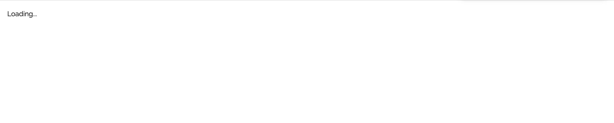
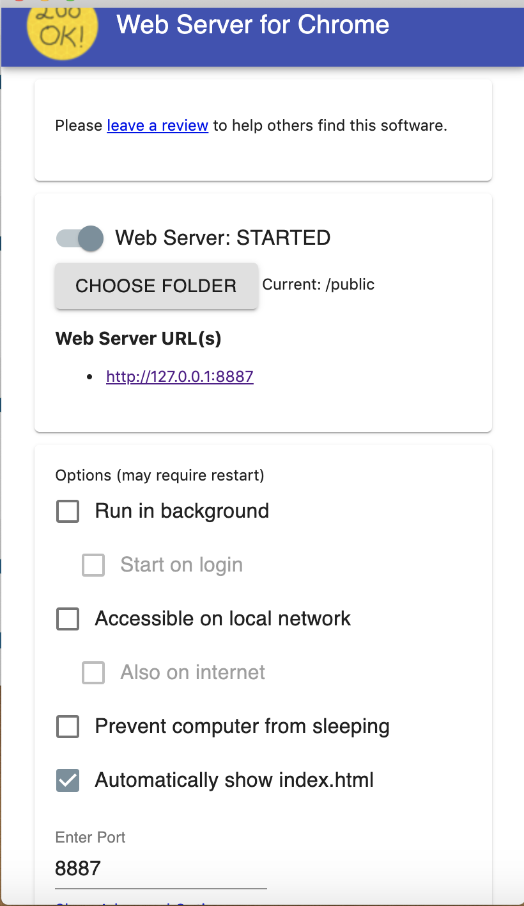

# Mars Dashboard Rover
Udacity nanodegree's accreditation Mars Rovers Dashboard project.

[](https://github.com/Harrisonkamau/mars-rovers-dashboard/actions/workflows/linter.yml)
[](https://github.com/Harrisonkamau/mars-rovers-dashboard/actions/workflows/tests.yml)


## Overview
Gets a Mars rover's photos and creates a gallery slider for them.

As a bonus, the backend also exposes an endpoint to retrieve the picture of the day.

The user selects a rover from a dropdown menu. The frontend makes an API call to the backend to retrieve that rover's most recent photos. In the meantime, a loading state is shown on the UI.

## Architecture
The frontend implements pure functions that serve as `Components` (if you are familiar with React). However, no frontend framework is installed. It's just the ol' HTML-CSS-JS mix. All JS code (UI components) are located in `src/public/client.js`.

The backend runs on Node.js / Express.js without a DB.

## Technologies
- HTML
- CSS
- JS
- Node.js / Express.js

## Setup
- Clone the repo
- copy the `.env.sample` into an `.env` file:
```shell
cp .env.sample .env
```
- replace `NASA_API_KEY` with an actual NASA API KEY created [here](https://api.nasa.gov/#browseAPI)
- install Node packages: `yarn install`
- start dev server: `yarn dev`. Keep this server running
- Install frontend server: [Chrome Web Server](https://chrome.google.com/webstore/detail/web-server-for-chrome/ofhbbkphhbklhfoeikjpcbhemlocgigb?hl=en)


### Important Note
The backend runs on port `4000` by default. Changing this requires updating the request URL on the client-side [here](https://github.com/Harrisonkamau/mars-rovers-dashboard/blob/main/src/public/client.js#L41) and [here](https://github.com/Harrisonkamau/mars-rovers-dashboard/blob/main/src/public/client.js#L56).
Ensure that you keep this server running all the time. The command to run the dev server is either `yarn dev` or `npm run dev`.

Opening the backend URL on the browser won't work as it does not have any UI. Once you have installed the Chrome web server as shown in the [Setup](https://github.com/Harrisonkamau/mars-rovers-dashboard#setup) step above, fire it up and select the `src/public` folder of the cloned repo. If the "`automatically show index.html`" setting is not checked, then check it and leave the default port `8887` as is. Navigate to `http://127.0.0.1:8887` on your browser and you should at this point be able to see the UI.

The photo of the day will be rendered by default. Scroll down the page or click on the animated `down-arrow` on the landing image) itself and select any rover from the dropdown menu. By design the landing image will be different every day :).

After selecting a rover, an API call will be made to the backend retrieve the selected rover's photos. After that the dropdown will be hidden and a set of tabs shown. To view the rover image, click on the `Gallery` tab and use the slider to navigate back and forth between images.

If the page only shows `Loading...`, check the browser's console. If the error is something like `Failed to load resource: net::ERR_CONNECTION_REFUSED`, then it shows that the backend server is NOT running. You can start it off using either `yarn dev` or `npm run dev` and then refresh the page (`http://127.0.0.1:8887`).

### Screenshots
**Landing Image**


**Loading Indicator**




**Chrome Web server setup interface**


